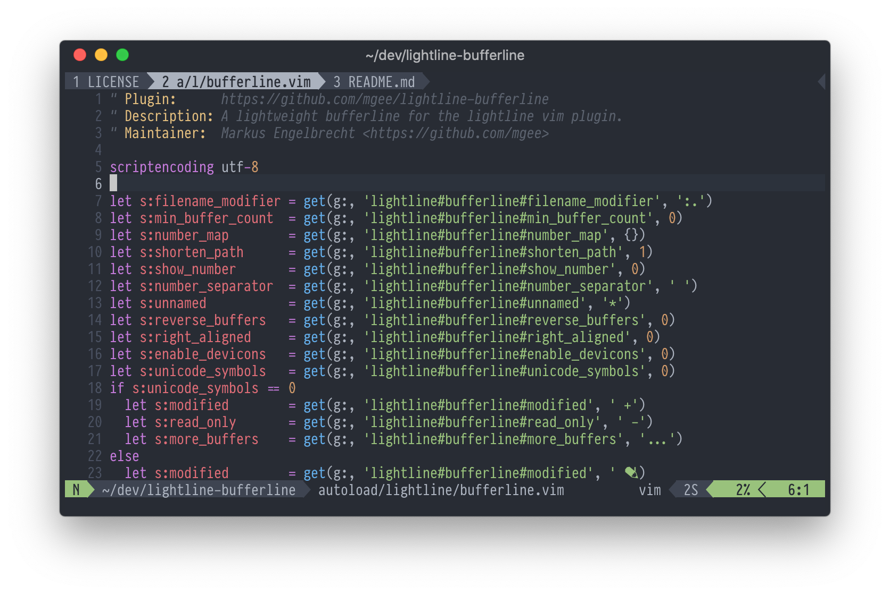

# lightline-bufferline

This plugin provides bufferline functionality for the [lightline](https://github.com/itchyny/lightline.vim) vim plugin.



## Table Of Contents

- [Installation](#installation)
- [Integration](#integration)
- [Configuration](#configuration)
- [Mappings](#mappings)
- [Example](#example)
- [License](#license)

## Installation

Installation can be easily done with a plugin manager of your choice. For example [vim-plug](https://github.com/junegunn/vim-plug):
```viml
Plug 'mgee/lightline-bufferline'
```

## Integration

1. Add `'buffers'` to `g:lightline.tabline`.
2. Add `'buffers': 'lightline#bufferline#buffers'` to `g:lightline.component_expand`.
3. Add `'buffers': 'tabsel'` to `g:lightline.component_type`.

The result looks for example like this:
```viml
let g:lightline.tabline          = {'left': [['buffers']], 'right': [['close']]}
let g:lightline.component_expand = {'buffers': 'lightline#bufferline#buffers'}
let g:lightline.component_type   = {'buffers': 'tabsel'}
```

## Configuration

##### `g:lightline#bufferline#filename_modifier`

The filename-modifier applied to each buffer name. Default is `':.'`.

##### `g:lightline#bufferline#modified`

The indicator to use for a modified buffer. Default is `'+'`.

##### `g:lightline#bufferline#more_buffers`

The indicator to use when there are buffers that are not shown on the bufferline because they didn't fit the available space. Default is `...`.

##### `g:lightline#bufferline#read_only`

The indicator to use for a read-only buffer. Default is `'-'`.

##### `g:lightline#bufferline#shorten_path`

Defines whether to shorten the path using the `pathshorten` function. Default is `1`.

##### `g:lightline#bufferline#show_number`

Defines whether to add the buffer number to the buffer name. Default is `0`.
Valid values are:
* `0`: No numbers
* `1`: Buffer number as shown by the `:ls` command
* `2`: Ordinal number (buffers are numbered from *1* to *n* sequentially)

##### `g:lightline#bufferline#number_map`

Dictionary mapping ordinal numbers (0-9) to their alternate character representations. Default is `{}`.

For example, to use unicode superscript symbols:
```viml
let g:lightline#bufferline#number_map = {
\ 0: '⁰', 1: '¹', 2: '²', 3: '³', 4: '⁴',
\ 5: '⁵', 6: '⁶', 7: '⁷', 8: '⁸', 9: '⁹'
\ }
```

When a mapping exists, no space is added before the buffer name.
Any desired spacing needs to be explicitly included as part of the mapped string.

*Note: The option only applies when `g:lightline#bufferline#show_number = 2`.*

##### `g:lightline#bufferline#unnamed`

The name to use for unnamed buffers. Default is `'*'`.

##### `g:lightline#bufferline#unicode_symbols`

Use unicode symbols for modified and read-only buffers as well as the more buffers indicator. Default is `0`.

If set to `1` the symbols `+`, `-` and `...` are replaced by `✎`, `` and `…`.

*Note: The symbols are only correctly displayed if your font supports these characters.*

## Mappings

This plugin provides Plug mappings to switch to buffers using their ordinal number in the bufferline.
To display the ordinal numbers in the bufferline use the setting `g:lightline#bufferline#show_number = 2`.

To use the Plug mappings you can use e.g. these mappings:
```viml
nmap <Leader>1 <Plug>lightline#bufferline#go(1)
nmap <Leader>2 <Plug>lightline#bufferline#go(2)
nmap <Leader>3 <Plug>lightline#bufferline#go(3)
nmap <Leader>4 <Plug>lightline#bufferline#go(4)
nmap <Leader>5 <Plug>lightline#bufferline#go(5)
nmap <Leader>6 <Plug>lightline#bufferline#go(6)
nmap <Leader>7 <Plug>lightline#bufferline#go(7)
nmap <Leader>8 <Plug>lightline#bufferline#go(8)
nmap <Leader>9 <Plug>lightline#bufferline#go(9)
nmap <Leader>0 <Plug>lightline#bufferline#go(10)
```

## Example

The following minimal example adds the bufferline to the lightline tabline and demonstrates a few custom bufferline options:
```viml
let g:lightline#bufferline#show_number  = 1
let g:lightline#bufferline#shorten_path = 0
let g:lightline#bufferline#unnamed      = '[No Name]'

let g:lightline                  = {}
let g:lightline.tabline          = {'left': [['buffers']], 'right': [['close']]}
let g:lightline.component_expand = {'buffers': 'lightline#bufferline#buffers'}
let g:lightline.component_type   = {'buffers': 'tabsel'}
```

## FAQ

**Q:** I can't see the tabline!<br/>
**A:** Add `set showtabline=2` to your configuration. This forces the tabline to always show.

**Q:** My vim GUI (MacVim, gVim, etc.) displays a graphical tabline and not the lightline tabline!<br/>
**A:** Add `set guioptions-=e` to your configuration (and guard it with `if has('gui_running') ... endif`).
This will disable the GUI tabline and enable the lightline tabline.

## License

Released under the [MIT License](LICENSE)
